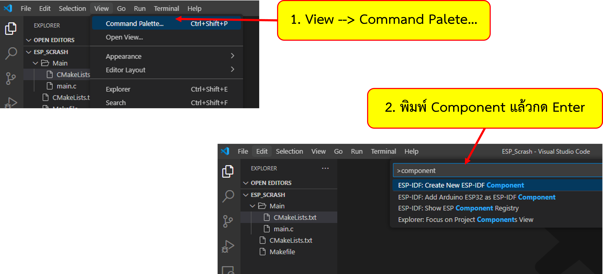
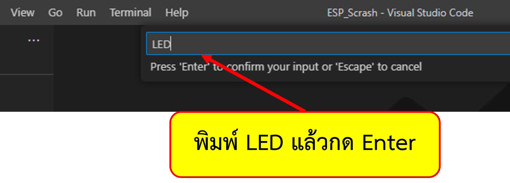
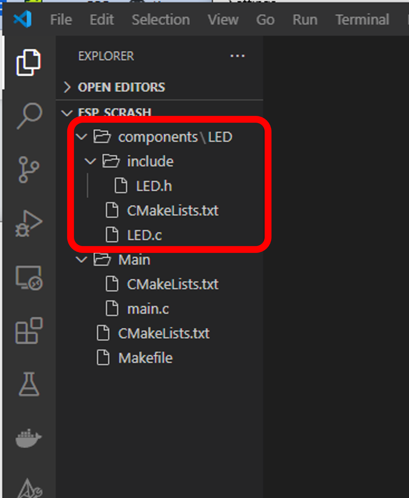

# ESP-Components

Components ใน ESP32 ใช้สำหรับเก็บ source code และทรัพยากรที่จะใช้กับ component ที่ต้องการ reuse ในโปรเจคอื่นๆ
การเพิ่ม component สามารถทำได้ที่ local เพื่อออกแบบ สร้าง และทดสอบการทำงานในระบบ หรือ นำเข้าจากแหล่งที่ตั้งภายนอก เช่น folder หรือ internet เพื่อนำมาใช้งานในระบบ

ในการทดลองนี้จะเริ่มจากการออกแบบและสร้าง component ขึ้นในระบบ (local)

## 1. สร้าง component ใหม่ โดยใช้ command palette

โดยทั่วไปแล้ว การสร้าง component ใดๆ สามารถทำได้เช่นเดียวกับการสร้าง component main ในใบงานที่ผ่านมา
ซึ่งนักศึกษาสามารถควบคุมองค์ประกอบต่างๆ ได้เองทั้งหมด แต่ในใบงานนี้เราจะทดลองสร้าง component ผ่านทาง command palette ของ VSCODE
แต่เมื่อสร้่างเสร็จแล้ว นักศึกษาสามารถเข้าไปแก้ไขได้เองเช่นเดียวกับใบงานที่ผ่านมา

1.1 สร้าง component ใหม่



vscode จะแสดงช่องให้ใส่ชื่อ component  ให้ตั้งชื่อเป็น LED



เมื่อกด enter จะได้โฟลเดอร์ของ component ชื่อ LED 



โดยมีเนื้อหาแต่ละไฟล์ดังต่อไปนี้

### CMakeLists.txt

``` CMake
idf_component_register(SRCS "LED.c"
                    INCLUDE_DIRS "include")
```

### LED.c

```c
#include <stdio.h>
#include "LED.h"

void func(void)
{

}
```


### LED.h

```c
void func(void);
```


## 2. แก้ไข code 
### 2.1 ไฟล์ LED.h

```c
void SET_LED_OUTPUT();
void LED_ON();
void LED_OFF();

```
### 2.2 ไฟล์ LED.c

```c
#include <stdio.h>
#include "LED.h"
#include "driver/gpio.h"

void SET_LED_OUTPUT()
{
  gpio_set_direction(5, GPIO_MODE_OUTPUT);  
}
void LED_ON()
{
    gpio_set_level(5,1);
}

void LED_OFF()
{
    gpio_set_level(5,0);
}
```
### 2.2 ไฟล์ CMakeLists.txt
```
idf_component_register(SRCS "LED.c"
                    INCLUDE_DIRS "include" 
                    REQUIRES driver)
```
### 2.4 ทดสอบรันโปรแกรม

